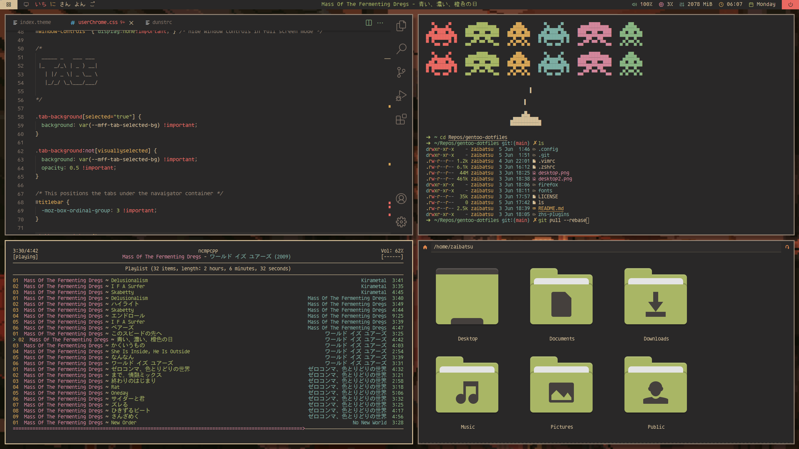
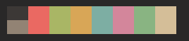

# dotfiles

## color scheme
I use a custom made gruvbox-material colorscheme with softer colors

## fonts
Agave Nerd Font as sytem font, icomoon-feather for polybar icons and umeboshi for Hiragana

## alacritty

I use a custom made colorscheme. Rest of the settings should be pretty standards

## bspwm

Pretty standard settings and nothing special here

## firefox

Theme is based on
[minimal-function-fox](https://github.com/mut-ex/minimal-functional-fox).
See the README of that repo for how to get it setup. I only ended up using the
userChrome.css and userContent.css files for my setup.

Install the [nightTab](https://addons.mozilla.org/en-US/firefox/addon/nighttab/)
extension to get the new tab page shown in my screenshot.

## ncmpcpp

I have configured the layout to my liking.

## pcmanfm

I have changed the settings to my liking and added the "hide menubar" patch.

## picom

I believe I use pretty standard settings for this

## polybar

My polybar files are based on the "polybar-4" theme from this repo:
https://github.com/adi1090x/polybar-themes. If you wish to recreate my polybar
look, you can either use this theme or my files as a starting point. My files
will have most of the things taken out that aren't used directly in my polybar,
so keep that in mind if you want to add things that aren't in my bar.

To get started, copy the contents of the `polybar` directory into:
`~/.config/polybar`

### config

My config has two bars -my main bar and my second monitor bar

### modules

Contains configs for modules built into polybar.

### user_modules

Contains modules created by me. This is also where I recommend adding your own
custom modules.

### launching

Make sure `launch.sh` is executable by running: `chmod +x launch.sh`.
Add `launch.sh` as a startup script so polybar launches every time you log in.

## rofi

I use a custom made theme as well as making it behave like clipboard manager

## sxhkd

For bspwm and rofi keybindings

## vscode

### extensions

Install the VSCode material gruvbox extension.

### settings.json

Contains the relevant parts of my `settings.json` file.

## folders and gtk

A modified version of https://github.com/sainnhe/gruvbox-material-gtk